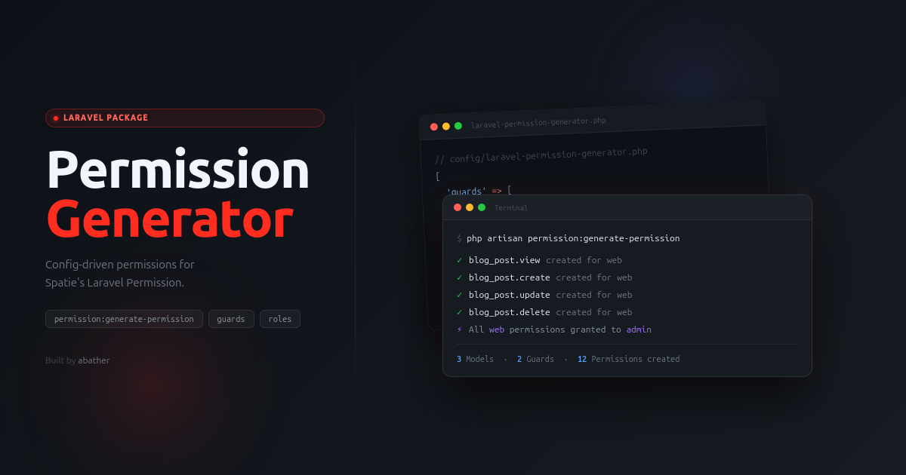

<p align="center">
  
</p>

# Laravel Permission Generator

[](https://packagist.org/packages/abather/laravel-permission-generator)
[](https://packagist.org/packages/abather/laravel-permission-generator)
[](https://github.com/Abather/laravel-permission-generator/actions/workflows/tests.yml)
[](LICENSE.md)

A Laravel package that automatically generates [Spatie Laravel Permission](https://github.com/spatie/laravel-permission) permissions from a config file. Define your models, abilities, and guards once — then run a single Artisan command to create every permission in the database.

## Requirements

- PHP 8.2+
- `spatie/laravel-permission` ^6 | ^7 | ^8

## Installation

```bash
composer require abather/laravel-permission-generator
```

Publish the config file:

```bash
php artisan vendor:publish --tag=config --provider="Abather\LaravelPermissionGenerator\PermissionGeneratorServiceProvider"
```

## Usage

After configuring `config/laravel-permission-generator.php`, run:

```bash
php artisan permission:generate-permission
```

The command will:
- Create any permission that does not yet exist
- Skip permissions that already exist
- Assign all permissions to the configured super role (per guard)
- Reset the permission cache automatically

---

## Configuration

The published config lives at `config/laravel-permission-generator.php`.

```php
<?php

return [

    'naming' => [
        'model_ability_separator'  => '.',
        'model_name_case'          => 'snake',
        'ability_name_case'        => 'snake',
        'model_name_position'      => 'before',
        'use_model_class_base_name' => true,
    ],

    'guards' => [

        'web' => [
            'models'            => [],
            'except'            => [],
            'abilities'         => [
                'view',
                'view_any',
                'create',
                'update',
                'restore',
                'delete',
                'force_delete',
            ],
            'custom_abilities'  => [],
            'other_permissions' => [],
            'super_role'        => 'admin',
        ],

    ],

    'models'      => [],

    'guards_path' => 'laravelPermissionGaurds',

];
```

---

### Naming

Controls how permission names are built from a model name + ability.

```php
'naming' => [
    'model_ability_separator'  => '.',      // separator between model and ability
    'model_name_case'          => 'snake',  // snake | camel | studly
    'ability_name_case'        => 'snake',  // snake | camel | studly
    'model_name_position'      => 'before', // before | after
    'use_model_class_base_name' => true,    // false = use FQCN, ignores model_name_case
],
```

**`model_ability_separator`** accepts a named alias or a literal symbol:

| Alias       | Character |
|-------------|-----------|
| `space`     | ` `       |
| `comma`     | `,`       |
| `dot`       | `.`       |
| `pipe`      | `\|`      |
| `colon`     | `:`       |
| `semicolon` | `;`       |
| `arrow`     | `→`       |
| any other string | used as-is |

**Examples** for `App\Models\BlogPost` with the `update` ability:

| separator | model_name_case | ability_name_case | model_name_position | Result |
|-----------|-----------------|-------------------|---------------------|--------|
| `dot` *(default)* | `snake` *(default)* | `snake` *(default)* | `before` *(default)* | `blog_post.update` |
| `colon`   | `camel`         | `snake`           | `after`             | `update:blogPost` |
| `arrow`   | `studly`        | `studly`          | `after`             | `Update→BlogPost` |
| `dot`     | *(ignored)*     | `snake`           | `before`            | `App\Models\BlogPost.update` *(FQCN when `use_model_class_base_name: false`)* |

---

### Global Models

Models defined at the top level are included in **every guard** automatically, in addition to any models defined inside individual guard blocks.

```php
// config/laravel-permission-generator.php

'models' => [
    App\Models\BlogPost::class,
    App\Models\Category::class,
],
```

This is the right place for models that need permissions across all guards. Guard-specific models are still supported (see below).

---

### Guards

Define one entry per guard. Each guard has its own models, abilities, custom abilities, other permissions, and super role.

```php
'guards' => [
    'web' => [
        'models'            => [],
        'except'            => [],
        'abilities'         => [...],
        'custom_abilities'  => [],
        'other_permissions' => [],
        'super_role'        => 'admin',
    ],
],
```

#### `models`

Eloquent model classes scoped to this guard only. Models listed in the top-level `models` key are merged in automatically and do not need to be repeated here.

```php
'models' => [
    App\Models\AdminLog::class,   // only needed under this specific guard
],
```

#### `except`

Model classes to exclude from the top-level `models` list for this guard only. Useful when a globally shared model should not generate permissions under a specific guard.

```php
'except' => [
    App\Models\AdminLog::class,
],
```

> **Note:** The exclusion only applies to models coming from the global `models` key. If the same model is also listed in this guard's own `models` array, it will still be included — the explicit guard-level entry takes precedence.

#### `abilities`

The default abilities applied to every model in this guard.

```php
'abilities' => [
    'view',
    'view_any',
    'create',
    'update',
    'restore',
    'delete',
    'force_delete',
],
```

#### `custom_abilities`

Extra abilities for specific models, added on top of the default abilities.

```php
'custom_abilities' => [
    App\Models\BlogPost::class => ['publish', 'archive'],
],
```

#### `other_permissions`

Permissions not tied to any model. These are created exactly as written, bypassing the naming settings.

```php
'other_permissions' => [
    'viewPulse',
    'viewHorizon',
    'access_admin_panel',
],
```

#### `super_role`

When set, the role is created if it does not exist and all permissions for this guard are assigned to it. Set to `null` to disable.

```php
'super_role' => 'admin',
```

---

## Per-Model Overrides

Models can override both abilities and custom abilities directly, keyed by guard name. This is useful when a model needs a different set of abilities than the global default.

### `$abilities`

Overrides the guard's default abilities for this model.

```php
class BlogPost extends Model
{
    public static array $abilities = [
        'web' => ['view', 'update'],   // only these two instead of the default list
    ];
}
```

### `$custom_abilities`

Adds extra abilities on top of whatever the model resolves from the default list. Merged with `$abilities` (or the guard default) at generation time.

```php
class BlogPost extends Model
{
    public static array $custom_abilities = [
        'web' => ['publish', 'archive'],
    ];
}
```

Both properties can coexist on the same model. Model-level definitions take precedence over config-level ones for the same guard.

---

## Multiple Guards

Duplicate the guard block for each guard you need:

```php
'guards' => [

    'web' => [
        'models'   => [App\Models\BlogPost::class],
        'abilities' => ['view', 'create', 'update', 'delete'],
        'super_role' => 'admin',
        // ...
    ],

    'api' => [
        'models'   => [App\Models\BlogPost::class],
        'abilities' => ['view', 'create', 'update', 'delete'],
        'super_role' => null,
        // ...
    ],

],
```

### Per-guard config files (alternative)

For large projects where the main config becomes crowded, each guard can live in its own dedicated file. Generate one with:

```bash
php artisan permission:guard-config api
```

This creates `config/laravelPermissionGaurds/api.php` containing the same keys (`models`, `except`, `abilities`, `custom_abilities`, `other_permissions`, `super_role`) as an inline guard block.

`permission:generate-permission` automatically discovers every `.php` file in that directory and loads it as a guard config, using the filename (without extension) as the guard name. Guards defined inline in the main config always take precedence over file-based ones with the same name.

The directory is configurable via the `guards_path` key (relative to Laravel's `config/` directory):

```php
'guards_path' => 'laravelPermissionGaurds', // default
```

Both approaches can be used together — some guards inline, others in separate files.

---

## Using PermissionGenerator in Policies

`PermissionGenerator` can be used inside Laravel Policy classes to resolve permission names dynamically using the same naming config, keeping your policies and your generated permissions always in sync.

```php
use Abather\LaravelPermissionGenerator\PermissionGenerator;
```

`PermissionGenerator` exposes three methods:

| Method | Returns | Description |
|--------|---------|-------------|
| `::make($model, $ability)->permission()` | `string` | The resolved permission name |
| `::make($model, $ability)->hasPermission($user)` | `bool` | Whether the user has the permission; safe when `$user` is `null` |
| `::check($model, $ability, $user)` | `bool` | Shorthand for the above; convenient for simple one-liners |

### Checking permissions in individual policy methods

Use `::check()` for simple cases where you only need the boolean result:

```php
class UserPolicy
{
    public function viewAny(User $user): bool
    {
        return PermissionGenerator::check(User::class, 'view_any', $user);
    }

    public function update(User $user, User $model): bool
    {
        return PermissionGenerator::check(User::class, 'update', $user);
    }
}
```

### Checking permissions in the `before` method

The `before` method runs before any other policy method. Returning `null` lets the individual method decide; returning `false` denies immediately. This is the cleanest approach when every method in the policy maps directly to a generated permission:

```php
class UserPolicy
{
    public function before(User $user, string $ability): bool|null
    {
        if (! PermissionGenerator::check(User::class, $ability, $user)) {
            return false;
        }

        return null;
    }

    public function viewAny(User $user): bool
    {
        // additional conditions beyond the permission check
        return $user->is_active;
    }
}
```

If you only need the raw permission name string (e.g. to use with `$user->can()` or in a Gate check), use `->permission()` directly:

```php
$permissionName = PermissionGenerator::make(User::class, 'update')->permission();
// e.g. "user.update" with default config
```

---

## License

MIT
